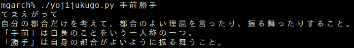

# yojijukugo-lookup
Look up definitions for Japanese yojijukugo (四字熟語) on Jitenon

四字熟語辞書ツール

This script extracts definitions from https://yoji.jitenon.jp/  
It can be used standalone or through Goldendict program execution feature.

### Installation
Grab the [yojijukugo.py](yojijukugo.py) file from this repository and execute it with python.
BeautifulSoup4 is a requirement, which can be installed through pip.  
`python -m pip install beautifulsoup4`

